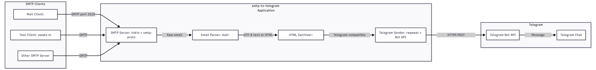

# SMTP to Telegram

Rust project for forwarding messages received via SMTP to a Telegram bot.

## System Architecture



## Description

This project implements an SMTP server that receives incoming email messages and automatically forwards their text to a specified Telegram chat via Bot API.

## Requirements

- Rust (version 1.70 or higher)
- Telegram Bot Token (obtain from [@BotFather](https://t.me/botfather))
- Telegram Chat ID (ID of the chat where messages will be sent)

## Installation

```bash
cargo build --release
```

## Usage

```bash
./target/release/smtp-to-telegram --token YOUR_BOT_TOKEN --chat-id YOUR_CHAT_ID [--port PORT] [--bind ADDRESS]
```

### Parameters

- `--token` / `-t`: Telegram Bot Token (required)
  - Environment variable: `TELEGRAM_TOKEN`
- `--chat-id` / `-c`: Telegram Chat ID (required)
  - Environment variable: `TELEGRAM_CHAT_ID`
- `--port` / `-p`: SMTP server port (optional, default: 2525)
  - Environment variable: `SMTP_PORT`
- `--bind` / `-b`: Bind address for SMTP server (optional, default: 0.0.0.0)
  - Environment variable: `SMTP_BIND`
- `--help` / `-h`: Show help message and exit

The server will listen on the specified port (or 2525 by default) for incoming SMTP connections. Make sure the port is not already in use and that your firewall allows connections to this port.

### Example

```bash
./target/release/smtp-to-telegram \
  --token "123456:ABC-DEF1234ghIkl-zyx57W2v1u123ew11" \
  --chat-id "123456789" \
  --port 2525 \
  --bind 0.0.0.0
```

### Using Environment Variables

All parameters can also be set using environment variables:

```bash
export TELEGRAM_TOKEN="123456:ABC-DEF1234ghIkl-zyx57W2v1u123ew11"
export TELEGRAM_CHAT_ID="123456789"
export SMTP_PORT=2525
export SMTP_BIND=0.0.0.0

./target/release/smtp-to-telegram
```

## How to Get Chat ID

1. Send a message to your bot in Telegram
2. Open in browser: `https://api.telegram.org/bot<YOUR_TOKEN>/getUpdates`
3. Find `"chat":{"id":123456789}` in the response - this is your Chat ID

## How to Use

After starting the server, you can send emails to an address that points to your server (port 2525 by default). The message text will be automatically forwarded to the specified Telegram chat.

### Example sending via telnet

```bash
telnet localhost 2525
HELO example.com
MAIL FROM:<sender@example.com>
RCPT TO:<recipient@example.com>
DATA
Subject: Test

This is a test message.
.
QUIT
```

### Testing with swaks

You can test the SMTP server using `swaks` (Swiss Army Knife for SMTP). Install it first:

```bash
# On Debian/Ubuntu
sudo apt-get install swaks

# On macOS
brew install swaks

# On Fedora/RHEL
sudo dnf install swaks
```

#### Basic text message

```bash
swaks --to user@example.com --from sender@example.com --server localhost:2525 --data "Subject: Test Message

Hello, this is a test message!"
```

#### Message with AUTH PLAIN

```bash
swaks \
  --to user@example.com \
  --from sender@example.com \
  --server localhost:2525 \
  --auth PLAIN \
  --auth-user sender@example.com \
  --auth-password x \
  --data "Subject: Test Message

Hello, this is a test message!"
```

#### Message with AUTH LOGIN

The same as above, but using `--auth LOGIN` instead of `--auth PLAIN`:

```bash
swaks \
  --to user@example.com \
  --from sender@example.com \
  --server localhost:2525 \
  --auth LOGIN \
  --auth-user sender@example.com \
  --auth-password x \
  --data "Subject: Test Message

Hello, this is a test message!"
```

#### HTML message

```bash
swaks --to user@example.com --from sender@example.com --server localhost:2525 --data "Subject: HTML Test
Content-Type: text/html; charset=utf-8

<h1>Hello!</h1>
<p>This is an <b>HTML</b> message with <i>formatting</i>.</p>"
```

#### Message with quoted-printable encoding

```bash
swaks --to user@example.com --from sender@example.com --server localhost:2525 --data "Subject: Test
Content-Type: text/plain; charset=utf-8
Content-Transfer-Encoding: quoted-printable

Hello!=20This=20is=20a=20quoted-printable=20encoded=20message=21
Line=20with=20spaces=20and=20special=20=3D=20characters."
```

#### Message with base64 encoding

```bash
swaks --to user@example.com --from sender@example.com --server localhost:2525 --data "Subject: Test
Content-Type: text/plain; charset=utf-8
Content-Transfer-Encoding: base64

SGVsbG8hIFRoaXMgaXMgYSBiYXNlNjQgZW5jb2RlZCBtZXNzYWdlLg=="
```

#### Long message (will be split into chunks)

```bash
swaks --to user@example.com --from sender@example.com --server localhost:2525 --data "Subject: Long Message

$(python3 -c 'print("A" * 5000)')"
```

#### Using a file as message body

```bash
# Create a test file
echo "Subject: File Test

This is the message body from a file." > message.txt

# Send it
swaks --to user@example.com --from sender@example.com --server localhost:2525 --data @message.txt
```

## Features

- Asynchronous SMTP server based on Tokio
- Support for basic SMTP commands (HELO, EHLO, MAIL FROM, RCPT TO, DATA, QUIT, RSET, NOOP)
- Automatic text extraction from email messages
- Message sending to Telegram via Bot API
- Error handling and logging

## Dependencies

- `tokio` - asynchronous runtime
- `smtp-proto` - SMTP protocol parsing
- `reqwest` - HTTP client for Telegram API
- `clap` - command line argument parsing
- `anyhow` - error handling

## Docker

### Build Docker image

Build the Docker image using `docker build`:

```bash
docker build -t smtp-to-telegram .
```

This will:
1. Use the multi-stage build process to compile the Rust application
2. Create a minimal runtime image with only the compiled binary
3. Tag the image as `smtp-to-telegram`

**Build options:**

- Build with a specific tag:
  ```bash
  docker build -t smtp-to-telegram:latest .
  ```

- Build with version tag:
  ```bash
  docker build -t smtp-to-telegram:v0.1.0 .
  ```

- Build without cache (for clean rebuild):
  ```bash
  docker build --no-cache -t smtp-to-telegram .
  ```

- Build with progress output:
  ```bash
  docker build --progress=plain -t smtp-to-telegram .
  ```

### Pull Docker image from GitHub Container Registry

You can use the pre-built Docker image from GitHub Container Registry without building it locally:

```bash
docker pull ghcr.io/deckersu/smtp-to-telegram:latest
```

Or pull a specific version:
```bash
docker pull ghcr.io/deckersu/smtp-to-telegram:0.1.0
```

**Note:** The image can be built and published to GitHub Container Registry manually by the author using GitHub Actions workflows.

### Run with Docker

**Note:** If a container with the same name already exists, remove it first:
```bash
docker rm -f smtp-to-telegram
```

#### Using command-line arguments

Run the container with parameters passed directly to the binary:

Using the image from GitHub Container Registry:
```bash
docker run -d \
  --name smtp-to-telegram \
  -p 2525:2525 \
  ghcr.io/deckersu/smtp-to-telegram:latest \
  --token "YOUR_BOT_TOKEN" \
  --chat-id "YOUR_CHAT_ID" \
  --port 2525 \
  --bind 0.0.0.0
```

Or use `--rm` flag to automatically remove the container when it stops:
```bash
docker run -d --rm \
  --name smtp-to-telegram \
  -p 2525:2525 \
  ghcr.io/deckersu/smtp-to-telegram:latest \
  --token "YOUR_BOT_TOKEN" \
  --chat-id "YOUR_CHAT_ID" \
  --port 2525 \
  --bind 0.0.0.0
```

**Note:** If you built the image locally, you can use `smtp-to-telegram` instead of `ghcr.io/deckersu/smtp-to-telegram:latest`.

#### Using environment variables

Run the container using environment variables:

Using the image from GitHub Container Registry:
```bash
docker run -d \
  --name smtp-to-telegram \
  -p 2525:2525 \
  -e TELEGRAM_TOKEN="YOUR_BOT_TOKEN" \
  -e TELEGRAM_CHAT_ID="YOUR_CHAT_ID" \
  -e SMTP_PORT=2525 \
  -e SMTP_BIND=0.0.0.0 \
  ghcr.io/deckersu/smtp-to-telegram:latest
```

Or use `--rm` flag to automatically remove the container when it stops:
```bash
docker run -d --rm \
  --name smtp-to-telegram \
  -p 2525:2525 \
  -e TELEGRAM_TOKEN="YOUR_BOT_TOKEN" \
  -e TELEGRAM_CHAT_ID="YOUR_CHAT_ID" \
  -e SMTP_PORT=2525 \
  -e SMTP_BIND=0.0.0.0 \
  ghcr.io/deckersu/smtp-to-telegram:latest
```

### Custom port and bind address

Using command-line arguments:
```bash
docker run -d \
  --name smtp-to-telegram \
  -p 2526:2526 \
  ghcr.io/deckersu/smtp-to-telegram:latest \
  --token "YOUR_BOT_TOKEN" \
  --chat-id "YOUR_CHAT_ID" \
  --port 2526 \
  --bind 0.0.0.0
```

Using environment variables:
```bash
docker run -d \
  --name smtp-to-telegram \
  -p 2526:2526 \
  -e TELEGRAM_TOKEN="YOUR_BOT_TOKEN" \
  -e TELEGRAM_CHAT_ID="YOUR_CHAT_ID" \
  -e SMTP_PORT=2526 \
  -e SMTP_BIND=0.0.0.0 \
  ghcr.io/deckersu/smtp-to-telegram:latest
```

### View logs

```bash
docker logs -f smtp-to-telegram
```

### Docker Compose

You can use Docker Compose to run the application with environment variables:

**Note:** By default, `docker-compose.yml` builds the image locally. To use the pre-built image from GitHub Container Registry, modify `docker-compose.yml` and replace `build: .` with `image: ghcr.io/deckersu/smtp-to-telegram:latest`.

1. Copy the example environment file:
   ```bash
   cp .env.example .env
   ```

2. Edit `.env` file and set your Telegram bot token and chat ID:
   ```bash
   TELEGRAM_TOKEN=your_bot_token_here
   TELEGRAM_CHAT_ID=your_chat_id_here
   SMTP_PORT=2525
   SMTP_BIND=0.0.0.0
   ```

3. Build and start the service:
   ```bash
   docker-compose up -d
   ```

4. View logs:
   ```bash
   docker-compose logs -f
   ```

5. Stop the service:
   ```bash
   docker-compose down
   ```

6. Rebuild and restart:
   ```bash
   docker-compose up -d --build
   ```

**Environment variables:**
- `TELEGRAM_TOKEN` - Telegram Bot Token (required)
- `TELEGRAM_CHAT_ID` - Telegram Chat ID (required)
- `SMTP_PORT` - SMTP server port (default: 2525)
- `SMTP_BIND` - Bind address (default: 0.0.0.0)

### Stop and remove container

Stop the container:
```bash
docker stop smtp-to-telegram
```

Remove the container:
```bash
docker rm smtp-to-telegram
```

Or stop and remove in one command:
```bash
docker rm -f smtp-to-telegram
```

**Note:** The application handles SIGTERM and SIGINT signals for graceful shutdown. When you stop the container with `docker stop`, it will send SIGTERM signal and the application will shut down gracefully.

### Check if container exists

To check if a container with the name already exists:
```bash
docker ps -a | grep smtp-to-telegram
```

If it exists, remove it before starting a new one:
```bash
docker rm -f smtp-to-telegram
```

## License

MIT
